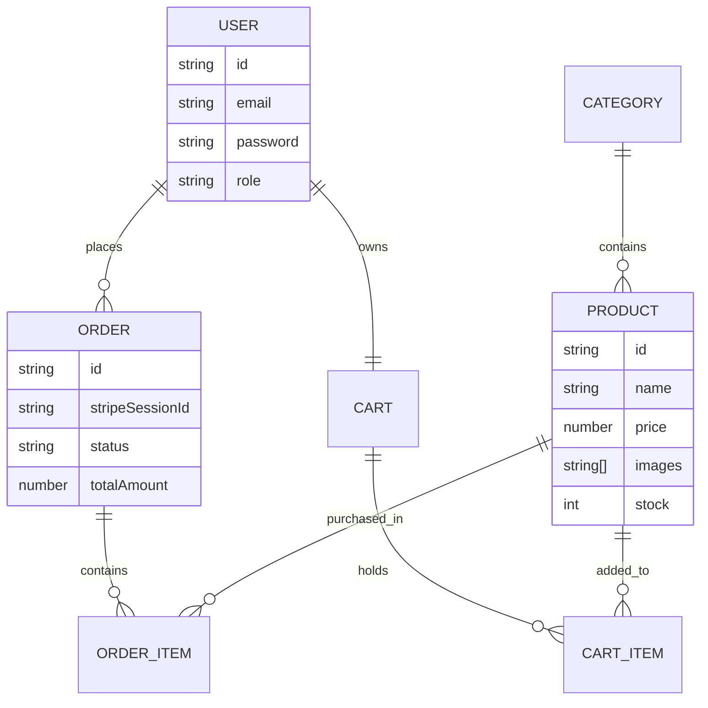

Here is a comprehensive `README.md` for your e-commerce backend. It covers the Dockerized setup, the architecture you've built, and the API flow we've been testing.

---

# 🛒 E-Commerce Backend API

A robust, Dockerized Node.js RESTful API for e-commerce, featuring **Stripe** payments, **Cloudinary** image processing, and **Jest** E2E testing with 100% logic coverage.

## 🏗 Architecture Overview

The project follows a **Layered Architecture (Service-Repository Pattern)** to separate concerns and ensure testability.

* **Controller Layer:** Handles HTTP requests, extracts data, and calls the appropriate service.
* **Service Layer:** Contains the "Business Logic" (e.g., calculating totals, handling Stripe sessions, triggering Cloudinary deletions).
* **Model Layer:** Defines Mongoose schemas and data validation.
* **Utils Layer:** Helper functions for third-party integrations (Cloudinary, Stripe Webhooks).
* **Middleware:** Handles Authentication (JWT), File Uploads (Multer), and Global Error Handling.

### 🗺 Database Relationship Diagram



---

## 🚀 Setup Instructions

### Prerequisites
* [Docker Desktop](https://www.docker.com/products/docker-desktop/)
* [Stripe CLI](https://stripe.com/docs/stripe-cli) (Optional, for local webhook testing)

### 1. Environment Configuration
Create a `.env` file in the root directory:
```env
PORT=5000
MONGO_URI=mongodb://mongodb:27017/ecommerce_db
JWT_SECRET=your_jwt_secret
STRIPE_SECRET_KEY=sk_test_...
STRIPE_WEBHOOK_SECRET=whsec_...
CLOUDINARY_CLOUD_NAME=...
CLOUDINARY_API_KEY=...
CLOUDINARY_API_SECRET=...
CLOUDINARY_FOLDER=ecommerce-products
```

### 2. Run with Docker
Build and start the API and MongoDB containers:
```bash
docker-compose up --build
```

### 3. Running Tests & Coverage
Run the full E2E test suite inside a clean Docker environment:
```bash
# Run tests and generate coverage report
docker-compose run --rm api npm run test:coverage
```
*Coverage reports will be generated in the `/coverage` folder.*

---

## 📖 API Documentation (Key Endpoints)

### 🔐 Authentication
| Method | Endpoint | Description |
| :--- | :--- | :--- |
| `POST` | `/api/v1/auth/signup` | Create a new account |
| `POST` | `/api/v1/auth/login` | Get JWT Token |

### 📦 Products & Categories
| Method | Endpoint | Description |
| :--- | :--- | :--- |
| `GET` | `/api/v1/categories` | List all categories |
| `POST` | `/api/v1/products` | Create product (Supports Image Upload) |
| `DELETE` | `/api/v1/products/:id` | Delete product & Cloudinary images |

### 🛒 Cart & Checkout
| Method | Endpoint | Description |
| :--- | :--- | :--- |
| `POST` | `/api/v1/cart` | Add items to cart |
| `POST` | `/api/v1/orders/checkout` | Create Stripe Checkout Session |
| `POST` | `/webhook` | Stripe Webhook (Success/Fail/Expire) |

---

## 🧪 Manual Testing with Postman
We have included a pre-configured Postman Collection to help you test the API flow without manual setup.

1. Import the Collection

Open Postman.

Click the Import button in the top-left corner.

Select the file located at ./postman/ecommerce_api.postman_collection.json.

2. Configure Environment Variables

The collection uses variables to handle authentication automatically. Ensure the following variables are set in your Postman Environment (or Collection Variables):

base_url: http://localhost:5000/api/v1

token: (Leave empty; populated automatically upon Login)

category_id: (Populate this after creating a category to use in Product creation)

3. Automated Authentication Flow

The Login request contains a "Test Script" that automatically captures the JWT from the response and saves it to the {{token}} variable.

Note: Once you login, you don't need to copy-paste tokens! Subsequent requests (Create Product, Checkout) will use the saved token automatically.

4. Testing Image Uploads

For the Create Product request:

Go to the Body tab.

Ensure form-data is selected.

For the image key, hover over the value cell and change the type from "Text" to "File".

Select a sample .jpg or .png from your local machine.

## 🧪 Testing Strategy

The project utilizes **Jest** and **Supertest** to achieve high coverage:
1.  **Mocks:** Third-party services (Stripe/Cloudinary) are mocked using `PassThrough` streams to simulate real file uploads without hitting API limits.
2.  **Order Flow:** Tests a complete user journey from signup → product creation → cart → payment webhook simulation.
3.  **Edge Cases:** Explicitly tests `checkout.session.expired` and `payment_intent.payment_failed` to ensure database integrity even when payments fail.
